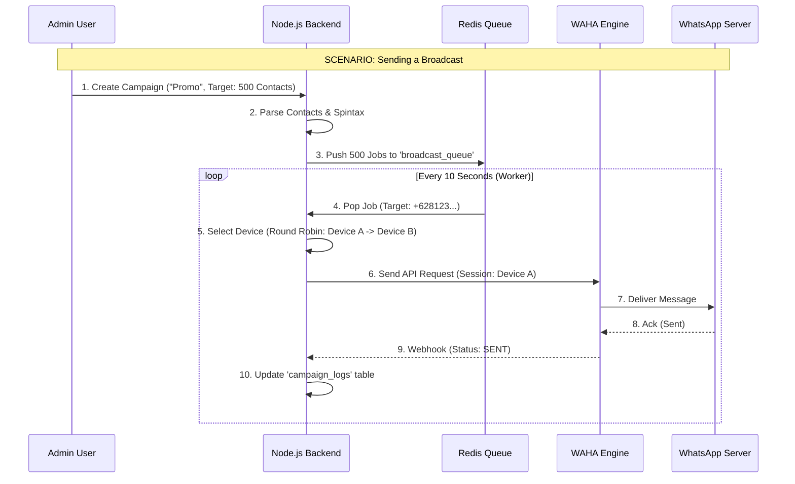

**Marketing Automation Engine**
---

# 🏭 Project Blueprint: Local Plasgos Clone (The Core)

## 1. Feature Mapping (Plasgos vs. Your Local Clone)

| Plasgos Feature | Your Technical Implementation (Local Server) |
| :--- | :--- |
| **Multi-User SaaS** | **Auth System** (JWT + bcrypt) with user-specific data isolation. |
| **Subscription Plan** | **Tiered Access** (e.g., Free, Pro, Enterprise) controlling device/contact limits. |
| **Unlimited Broadcast** | **BullMQ Job Queue** with controllable delays (e.g., 1 msg / 5-15 sec). |
| **Multi-Sender Shuffle** | **Round-Robin Logic** in Node.js that rotates between connected WAHA sessions. |
| **Spintax Replacement** | A simple Regex utility to spin text `{Hello|Hi|Halo}` to avoid spam detection. |
| **Contact Import/Grab** | **WAHA API** to fetch group participants + CSV Parser in Node.js. |
| **Smart Auto Reply** | **RAG Engine** (Redis + OpenAI) + **Keyword Matcher** (MySQL). |
| **Link Rotator** | A lightweight **Express Route** (`/link/:id`) that redirects users to different WhatsApp numbers. |
| **Team Management** | **RBAC (Role-Based Access Control)** for multiple agents under one user. |

---

## 2. Database Schema (The Backbone)

*We need a robust schema to handle multiple devices, thousands of contacts, and complex campaigns.*

### A. Core Tables (`mysql`)

**1. `users` (The Core Account)**

* `id`, `email`, `password_hash`, `role` (admin/user/agent), `subscription_status`, `current_package_id`.
* *Feature:* Multi-user SaaS foundation.

**1a. `subscription_packages` (Plan Definitions)**

* `id`, `name`, `price`, `max_devices`, `max_contacts`, `features` (JSON).

**1b. `user_subscriptions` (Ledger)**

* `id`, `user_id`, `package_id`, `expiry_date`, `payment_status`.

**2. `devices` (Connected WhatsApp Numbers)**

* `id`, `session_name` (matches WAHA session), `phone_number`, `status` (CONNECTED/DISCONNECTED), `is_active_for_broadcast` (Boolean).
* *Plasgos Feature:* "Multi-Sender Shuffle".

**3. `contacts` (The Database)**

* `id`, `phone` (unique), `name`, `tags` (JSON array: `["VIP", "Lead"]`), `source` (e.g., "Group Grab", "Excel"), `created_at`.

**4. `campaigns` (Broadcast History)**

* `id`, `name`, `message_template` (contains Spintax), `target_tags` (JSON), `status` (PENDING, PROCESSING, COMPLETED), `scheduled_at`.

**5. `campaign_logs` (Reporting)**

* `id`, `campaign_id`, `contact_id`, `device_used_id`, `status` (SENT, FAILED), `timestamp`.

**6. `auto_replies` (Simple Chatbot)**

* `id`, `keyword` (e.g., "PRICE"), `match_type` (EXACT/CONTAINS), `response_text`, `media_path`.

**7. `link_rotators` (Traffic Distribution)**

* `id`, `slug` (e.g., `promo-june`), `target_numbers` (JSON: `["6281...", "6282..."]`), `click_count`.

---

## 3. Core Logic Modules (The Brain)

### Module A: The Broadcaster (Anti-Ban Technology)

*This is the heart of Plasgos. It ensures messages are sent safely.*

**Logic Flow:**

1. **Input:** User selects Tag "Leads" (1,000 people) and Message `"{Hi|Hello} [name], check this!"`.
2. **Job Creation:** Node.js splits this into 1,000 jobs in `broadcast_queue` (Redis).
3. **Worker (The Smart Sender):**
    * **Step 1:** Fetch available `devices` where `status=CONNECTED`.
    * **Step 2 (Rotator):** Pick the next device in the list (Round-Robin).
    * **Step 3 (Spintax):** Process message: `{Hi|Hello}` -> Randomly picks "Hi".
    * **Step 4 (Variable):** Replace `[name]` with "Budi".
    * **Step 5:** Send via WAHA API using the selected Session ID.
    * **Step 6:** Wait random delay (5–20 seconds) to mimic human behavior.

### Module B: Group Grabber (Lead Generation)

*Feature: Extract numbers from groups.*

**Logic:**

1. **Frontend:** User selects a connected Device and sees a list of Groups.
2. **Backend:** Call WAHA endpoint `GET /api/groups`.
3. **Action:** User clicks "Grab contacts from 'Community Reseller'".
4. **Backend:**
    * Call WAHA `GET /api/groups/{groupId}/participants`.
    * Loop through participants -> Insert into `contacts` table with tag `From Group X`.

### Module C: Link Rotator (Traffic Balancer)

*Feature: "50 WA Link Rotator".*

**Logic:**

1. **User creates link:** `http://your-server.com/link/promo`.
2. **Customer clicks link.**
3. **Backend (`GET /link/promo`):**
    * Fetch `target_numbers` from DB `["628111", "628222"]`.
    * Pick one (Random or Sequential).
    * Redirect user: `res.redirect('https://wa.me/628111?text=Hello')`.

---

## 4. API Endpoints (The Interface)

*Your Node.js Backend needs these routes.*

### User & Device Management

* `POST /auth/signup` - User registration.
* `POST /auth/login` - Login.
* `GET /packages` - List subscription plans.
* `POST /subscriptions/choose` - Purchase/select plan.
* `GET /devices` - List all connected WhatsApps for current user.
* `POST /devices/scan` - Start a new user-specific session & get QR Code.
* `DELETE /devices/:session` - Logout/Delete.

### Contact Manager

* `POST /contacts/upload` - Upload CSV/Excel (Use `multer` + `csv-parser`).
* `GET /contacts/groups` - Get list of WA groups from WAHA.
* `POST /contacts/grab` - Extract members from a group ID.

### Broadcast

* `POST /campaign/start` - Create a new blast.
  * Body: `{ message: "{Hi|Halo}...", tags: ["VIP"], schedule: "2026-05-01 10:00" }`
* `GET /campaign/stats/:id` - Get progress (Sent: 50, Failed: 2).

### Chat/Inbox (The "Switch to Human" feature)

* `GET /chats` - Get list of recent conversations (from MySQL or WAHA cache).
* `GET /chats/:phone/messages` - Get chat history.
* `POST /chats/:phone/send` - Manual reply (bypasses Bot).
* `POST /chats/:phone/toggle-bot` - Enable/Disable AI for this user.

---

## 5. Visual Flow (How it runs locally)



## 6. Actionable "To-Do" for AntiGravity

**Phase 1: Foundation**

1. Set up the **Database Schema** (Copy section 2 into a `.sql` file).
2. Install **WAHA Plus** (Support for multiple sessions is critical for the "Clone").

**Phase 2: The Logic (Node.js)**

1. **Implement Spintax Helper:**

    ```javascript
    function spinText(text) {
        return text.replace(/\{([^{}]+)\}/g, (match, choices) => {
            const options = choices.split('|');
            return options[Math.floor(Math.random() * options.length)];
        });
    }
    ```

2. **Implement Round-Robin Sender:**

    ```javascript
    let currentDeviceIndex = 0;
    async function getNextDevice() {
        const devices = await db.devices.find({ status: 'CONNECTED' });
        if (devices.length === 0) throw new Error('No devices');
        const device = devices[currentDeviceIndex % devices.length];
        currentDeviceIndex++;
        return device.session_name;
    }
    ```

**Phase 3: Integration**

1. Connect **BullMQ** to the Sender Logic.
2. Connect **WAHA Webhooks** to the Campaign Logger.
