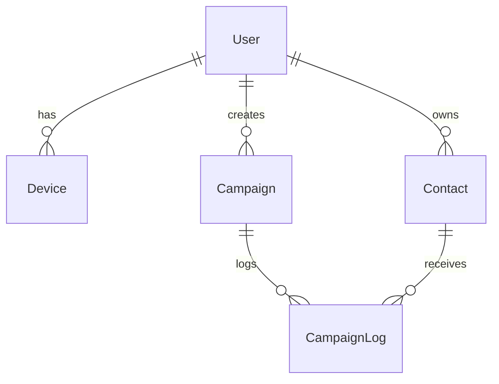

# Phase 1.4: Database Schema Setup - Implementation Summary

**Date**: 2026-01-03
**Status**: ✅ Completed
**Environment**: Dockerized (Node.js + Redis + OCR + Host MySQL via Docker Network)

## 📋 Overview

Successfully implemented the foundational database schema using Sequelize ORM. The backend is now fully integrated with the MySQL database relative to the host machine.

## ✅ Completed Tasks

### 1. Sequelize Initialization ✅
- Installed `sequelize` and `sequelize-cli`.
- Configured `.sequelizerc` for clean directory structure.
- Configured `src/config/config.js` to handle dynamic environment variables (Docker `host.docker.internal` vs Local).
- Updated `server.js` to use `db.sequelize.authenticate()` for connection verification.

### 2. Core Models Implemented ✅
We implemented the following models with UUID primary keys:

1.  **User (`src/models/user.js`)**
    -   Fields: `id`, `name`, `email`, `password`, `role`, `status`.
    -   Features: Automatic bcrypt password hashing on create/update.
    -   Associations: Has many Devices, Contacts, Campaigns.

2.  **Device (`src/models/device.js`)**
    -   Fields: `id`, `userId`, `sessionName` (WAHA session), `status`, `phoneNumber`.
    -   Associations: Belongs to User.

3.  **Contact (`src/models/contact.js`)**
    -   Fields: `id`, `userId`, `phoneNumber`, `name`, `tags` (JSON), `attributes` (JSON).
    -   Indexes: Unique constraint on `userId` + `phoneNumber`.

4.  **Campaign (`src/models/campaign.js`)**
    -   Fields: `id`, `userId`, `name`, `messageTemplate`, `status`, `scheduledAt`, `stats`.
    -   Associations: Has many CampaignLogs.

5.  **CampaignLog (`src/models/campaign_log.js`)**
    -   Fields: `id`, `campaignId`, `contactId`, `status`, `messageId` (WAHA).
    -   Indexes: Optimized for status checks and contact history.

### 3. Migrations & Seeding ✅
-   **Migration 01**: Created `users`, `devices`, `contacts`.
-   **Migration 02**: Created `campaigns`, `campaign_logs`.
-   **Seeder 01**: Created default Admin user (`admin@marketing.com` / `Admin@123`).

### 4. Docker Environment Fixes ✅
-   Resolved `root` access issues from Docker to Host MySQL by creating a dedicated `crm_admin` user.
-   Updated `docker-compose` and `.env` to use `crm_admin`.
-   Implemented "Self-Healing" database connection (auto-creates DB if missing).

## 📊 Database Schema Relationship

## 🚀 Next Steps (Phase 2: Core Infrastructure)

Now that the foundation and schema are ready, we will move to building the logic:

1.  **Authentication System**: Login/Signup endpoints using the `User` model.
2.  **WAHA Integration**: Real logic for `Device` model state management.
3.  **Contact Management**: CSV import logic using `Contact` model.
4.  **Broadcast Logic**: Using `Campaign` model and BullMQ.

---

**Phase 1.4 Status**: ✅ **COMPLETED**
