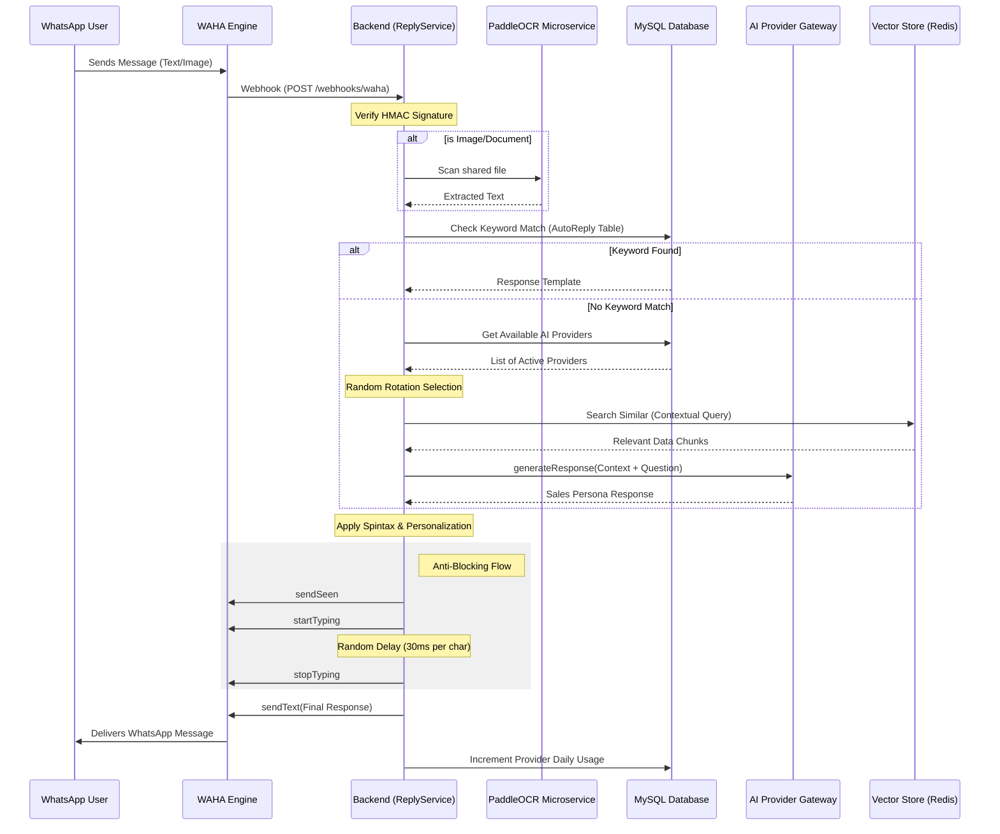

# Incoming Message Workflow & AI Rotation

**Date**: 2026-01-04
**Context**: Implementation of real-time device status sync and randomized AI provider load balancing.

## 🔄 System Flow Diagram

## 🛠️ Key Components

### 1. Device Status Synchronization
- **Real-time Check**: The API now verifies the session status against the WAHA Engine on every list request.
- **Fail-safe**: Devices missing in WAHA are marked as `DISCONNECTED` in the database, triggering a "Reconnect Required" UI state on the frontend.

### 2. AI Rotation & Load Balancing
- **Pool Management**: Supports multiple OpenAI-compatible API keys.
- **Selection Logic**: Picks a provider randomly among those with the same highest priority level who haven't hit their `dailyLimit`.
- **Automatic Reset**: `dailyUsed` counters are reset automatically by the service when the first request of a new UTC day arrives.

### 3. Integrated OCR
- Automatically triggered for images and documents.
- Converts visual data into searchable text before passing it to the Keyword or AI engines.

## 🚀 Future Enhancements (TODO)
- [ ] Grouping contacts by area code for localized responses.
- [ ] Integration of cooling periods between high-frequency replies.
- [ ] Advanced URL shortening for links in auto-replies.
